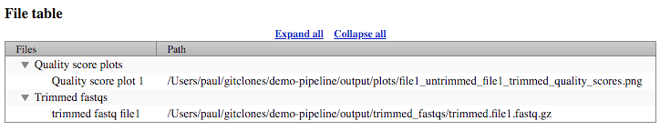

[](https://circleci.com/gh/ENCODE-DCC/demo-pipeline/tree/master)

<p align="center">
<a href="https://www.encodeproject.org">
  
</a>
</p>

ENCODE demo-pipeline
========================

This pipeline demonstrates the ENCODE pipeline reproducibility framework. Any pipeline deployed in this framework can be run on the cloud, on compute clusters with job-submission engines, or on stand-alone machines. It inherently makes use of parallelized/distributed computing. Pipeline installation is simple as most dependencies are automatically installed.

Here we implement a simple bioinformatics pipeline but surround it with all of the ENCODE pipeline reproducibility infrastructure.  The bioinformatic task is to use the [Trimmomatic](http://www.usadellab.org/cms/?page=trimmomatic) software to trim input FASTQs. The output includes the trimmed FASTQ and a plot of FASTQ quality scores before and after trimming. For simplicity this demo supports only single-end FASTQs.

After experimenting with this repo you can create your own fork and use it as a template to deploy your own pipeline, inheriting all of the multi-platform and reproducibility features.


# Local quickstart

System requirements:
  * [Java 8](https://www.java.com/en/download/) or higher.
  * [Docker CE](https://docs.docker.com/install/)
  * Python 3.4.1 or higher.

1. Clone this repo and install Python packages:
   * [Caper](https://github.com/ENCODE-DCC/caper#installation). Caper is a python wrapper for Cromwell.
   * [Croo](https://github.com/ENCODE-DCC/croo#installation)

  ```bash
  $ git clone https://github.com/ENCODE-DCC/demo-pipeline
  $ cd demo-pipeline
  $ pip install caper
  $ pip install croo
  ```

2. Add single-end FASTQ and Trimmomatic SLIDINGWINDOW parameter (filter reads that drop below average quality score of 30 in two-base window) to `input.json`:
```js
{
    "toy.fastqs": [
        "test/test_data/file1.fastq.gz"
    ],
    "toy.SLIDINGWINDOW": "2:30"
}
```

3. Run WDL workflow using `input.json`, Cromwell, and Docker backend using Caper. **WARNING:** Pulling the Docker image may take some time depending on your network connection speed, please be patient:

```bash
$ caper run toy.wdl -i examples/local/input.json --docker
```

4. Find the `metadata.json` in Caper's output directory and organize outputs with `croo`. The `WF_ID` is a unique key for the pipeline run and is indicated in Caper's logs.

```bash
$ croo toy/[WF_ID]/metadata.json --out-dir output
```

5. Examine outputs using the html page generated by croo:
```bash
# Mac only
$ open output/croo.report.[WF_ID].html
```


6. Examine quality score plot:
```bash
# Mac only
$ open output/plots/file1_untrimmed_file1_trimmed_quality_scores.png
```
<p align="center">

</p>


# Installation/tutorial

The following tutorials use Caper to run the pipeline, where applicable. For tutorials on running the pipeline without Caper, see [previous tutorials](docs/deprecated)

* [Local system with docker](docs/tutorial_local_docker.md)
* [Local system with singularity](docs/tutorial_local_singularity.md)
* [Google Cloud Platform](docs/tutorial_google.md)
* [DNANexus Platform with dxWDL CLI](docs/tutorial_dx_cli.md)
* [DNANexus Platform with Web UI](docs/tutorial_dx_web.md)
* [Stanford SCG](docs/tutorial_scg.md)
* [Stanford Sherlock 2.0](docs/tutorial_sherlock.md)


### [Input](docs/input.md)

### [Output](docs/output.md)
